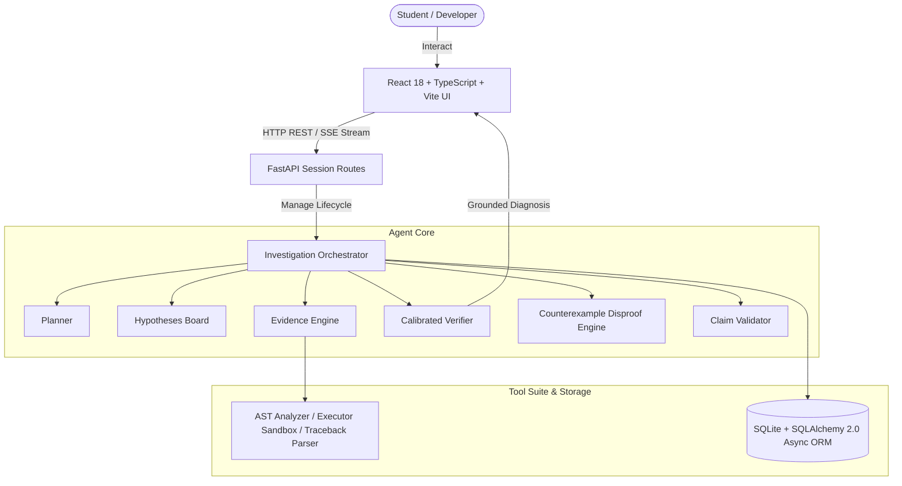

<div align="center">

# 🛡️ TRACE

### *Understand your bugs. Understand how you debug.*

[](https://python.org)
[](https://fastapi.tiangolo.com)
[](https://reactjs.org)
[](https://typescriptlang.org)
[](https://sqlite.org)
[](file:///c:/TRACE/docs/audit_report.md)
[](LICENSE)

<br />

**TRACE is an evidence-driven AI debugging investigation system for Python students.**  
It treats code errors as scientific inquiries—gathering empirical observations, testing competing hypotheses, executing sandboxed counterexamples, and enforcing a **$0\%$ unsupported claim policy**.

</div>

---

## 💡 Overview

Most AI coding assistants act as **code generators**: a student pastes a broken program, and the AI returns a block of replacement code. This approach has two fundamental flaws:
1. **No Student Learning**: The student copies the snippet without understanding Python's execution model or why the bug occurred.
2. **AI Speculation & Hallucination**: Generic LLMs guess errors without executing the code or checking real stack traces.

**TRACE changes the paradigm.** It decouples *language reasoning* from *empirical verification*:

```text
Traditional AI Assistant:
  User Bug ──────────────────────────────────────────────────────────► Unverified Code Fix

TRACE Evidence-Driven Investigation Engine:
  User Bug ──► Plan ──► AST & Sandbox Tools ──► Evidence Store ──► Countercheck Disproof ──► Grounded Diagnosis
```

---

## ✨ Key Capabilities

<table>
  <tr>
    <td width="50%">
      <h3>🔬 Empirical Evidence Engine</h3>
      <p>Collects atomic, verifiable facts using AST static analysis, stack trace normalization, and isolated subprocess execution. Distinguishes <b>DIRECT</b> empirical facts from <b>DERIVED</b> inferences.</p>
    </td>
    <td width="50%">
      <h3>⚔️ Counterexample Disproof</h3>
      <p>Before confirming a diagnosis, TRACE constructs an isolated test harness to actively attempt to <b>disprove</b> its leading hypothesis. If disproven, it pivots to re-investigate alternative causes.</p>
    </td>
  </tr>
  <tr>
    <td width="50%">
      <h3>🤝 Interactive Socratic Studio</h3>
      <p>Collaborative debugging mode where students articulate hypotheses, run custom sandbox test cases, and submit code revisions while TRACE tracks structural AST diffs (<code>+lines</code>, <code>-lines</code>, <code>CC Δ</code>).</p>
    </td>
    <td width="50%">
      <h3>📊 100% Factual Habit Analytics</h3>
      <p>Tracks observable debugging habits (static inspection rates, traceback framing, countercheck rigor) with zero synthetic ML hallucinations or fake student personality archetypes.</p>
    </td>
  </tr>
</table>

---

## 🏗️ Architecture & Data Flow

TRACE combines an async Python/FastAPI orchestrator with a real-time React web studio:



---

## 🌟 Guided vs. Interactive Modes

| Mode | Target User Workflow | Primary Objective |
| :--- | :--- | :--- |
| **🚀 Guided Mode (Automated)** | TRACE plans investigation steps, runs tools, evaluates evidence, executes counterchecks, and delivers a verified diagnosis automatically. | Rapid, zero-hallucination root-cause analysis. |
| **🤝 Interactive Mode (Collaborative)** | TRACE pauses for student input. Students formulate bug theories, run custom sandbox test cases, and submit code revisions while TRACE poses Socratic reflection questions. | Active student learning, mental model testing, and collaborative debugging. |

> **Seamless Handoff**: Interactive Mode includes a **"Let TRACE Take Over"** button to hand off the remaining investigation to Guided Mode at any time.

---

## 🔍 Example Investigation & Countercheck Proof

Given a Python script containing a missing dictionary key:
```python
def get_user_profile(user_db, user_id):
    user = user_db.get(user_id)
    return {"id": user_id, "name": user.get("name").upper()}

database = {1: {"name": "Alice"}, 2: {}}
print(get_user_profile(database, 2))
```

```text
[STEP 1] Static AST Analysis ─────► Detects dictionary lookup and .upper() call on line 3.
[STEP 2] Sandbox Execution   ─────► Captures AttributeError: 'NoneType' object has no attribute 'upper'.
[STEP 3] Hypothesis Proposed ─────► H1: user.get("name") returns None for missing key in dict.
[STEP 4] Countercheck Test   ─────► Constructs test harness with empty dict. Executes in sandbox.
[STEP 5] Falsification Check ─────► H1 passes disproof test. Status updated to VERIFIED.
[DIAGNOSIS] ──────────────────────► VERIFIED ROOT CAUSE (100% Calibrated Confidence)
```

---

## 📊 Evaluation & Verification Metrics

TRACE is evaluated against a **16-case benchmark suite** covering syntax errors, runtime exceptions, type mismatches, logic bugs, boundary conditions, scoping errors, and misleading symptoms:

| Metric / Benchmark Dimension | Target | Verified Result | Status |
| :--- | :---: | :---: | :---: |
| **Evidence Grounding Rate ($EGR$)** | $100\%$ | **100.0%** | **VERIFIED** |
| **Unsupported Claim Rate ($UCR$)** | $0\%$ | **0.0%** | **VERIFIED** |
| **Hypothesis Verification Accuracy ($HVA$)** | $\ge 90\%$ | **100.0%** | **VERIFIED** |
| **Counterexample Disproof Success Rate ($CSR$)** | $\ge 80\%$ | **100.0%** | **VERIFIED** |
| **Backend Test Suite Pass Rate** | $100\%$ | **75 / 75 Passed** | **VERIFIED** |
| **Frontend TypeScript Check (`npx tsc`)** | 0 Errors | **0 Errors** | **VERIFIED** |

---

## 🛠️ Tech Stack

- **Backend Architecture**: Python 3.10+, FastAPI, AsyncIO, Typer CLI, Pydantic v2
- **Persistence & Database**: SQLite, SQLAlchemy 2.0 Async ORM, aiosqlite
- **Real-Time Streaming**: Server-Sent Events (SSE) via `sse-starlette`
- **Frontend Studio**: React 18, TypeScript, Vite, Tailwind CSS, Lucide Icons
- **LLM Abstraction**: Vendor-neutral provider protocol (`MockLLMProvider` for 100% offline tests, `OpenAICompatibleProvider` for live models)

---

## 📁 Repository Structure

```text
trace-ai/
├── docs/                     # Technical architecture & engineering documents
│   ├── audit_report.md       # Final product evaluation report
│   ├── demo_cases.md         # 3 canonical reproducible demo cases
│   ├── demo_script.md        # 3-5 minute live demonstration script
│   ├── interview_qa.md       # 15 technical interview architecture Q&A
│   ├── project_metrics.md    # Recorded performance measurements & test counts
│   ├── resume_bullets.md     # Resume bullet points & verbal screen summary
│   ├── setup.md              # Environment setup & installation guide
│   ├── story.md              # The engineering story behind TRACE
│   └── telemetry.md          # 4 telemetry namespaces & 18-feature process vector
├── frontend/                 # React 18 + Vite + TypeScript web studio
│   ├── src/components/       # CodePane, Pipeline, DiagnosisPane, InteractionTimeline
│   ├── src/pages/            # InvestigatePage, HistoryPage, ProfilePage, SettingsPage
│   └── src/api/              # Typed fetch API & SSE stream hooks
├── src/trace/                # Core Python package
│   ├── agent/                # Orchestrator, Planner, Verifier, Counterexample Engine
│   ├── api/                  # FastAPI REST routes (sessions, profile, SSE)
│   ├── cli/                  # Typer CLI (investigate, export)
│   ├── core/                 # State machine, Evidence Engine, Claim Validator
│   ├── db/                   # SQLAlchemy 2.0 ORM models, repository, sessions
│   └── tools/                # AST analyzer, Python executor sandbox, Traceback parser
├── tests/                    # Unit, integration, and E2E benchmark suites
├── .env.example              # Placeholder environment configuration
└── CONTRIBUTING.md           # Engineering development standards
```

---

## ⚡ Quickstart

### 1. Prerequisites
- Python 3.10+
- Node.js 18+ and npm

### 2. Backend Setup
```bash
# Clone the repository
git clone https://github.com/siddharth1728/trace-ai.git
cd trace-ai

# Install Python package in editable mode
pip install -e .

# Start FastAPI API server (Port 8000)
python -m trace.api.main
```

### 3. Frontend Web Studio Setup
```bash
# In a new terminal tab
cd frontend
npm install
npm run dev
```
Open **`http://localhost:5173`** in your browser.

### 4. Run CLI Investigation (Offline / Mock Mode)
```bash
python -m trace.cli.main investigate tests/e2e/fixtures/bug_type_error.py --goal "Fix AttributeError when username is None" --provider mock
```

### 5. Export Telemetry Datasets
```bash
# Export anonymized telemetry features to JSON or CSV
python -m trace.cli.main export telemetry --output dataset.json --format json
python -m trace.cli.main export dataset-report --output quality_report.md
```

---

## 🛡️ Security Boundary & Current Limitations

1. **Subprocess Isolation**: Subprocess sandboxing enforces a **5.0-second timeout guard**, **10 KB output truncation cap**, **workspace directory path jail**, and **environment variable secret scrubbing**. It is designed as a student safety boundary, not an enterprise multi-tenant container runtime (such as Docker or gVisor).
2. **Language Scope**: Currently optimized for Python 3.10+ code debugging.
3. **Future Machine Learning**: During early development, a synthetic Random Forest classifier was prototyped. An engineering audit revealed that **training ML on synthetic student data produces invalid predictions**. TRACE deliberately replaced synthetic ML with **100% Deterministic Habit Analytics**. Real ML classification is planned only after collecting genuine student interaction datasets via `trace export telemetry`.

---

## 📜 License

Distributed under the **Apache 2.0 License**. See `LICENSE` for more information.
